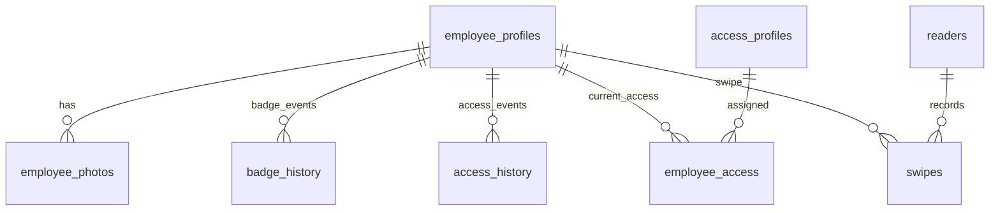
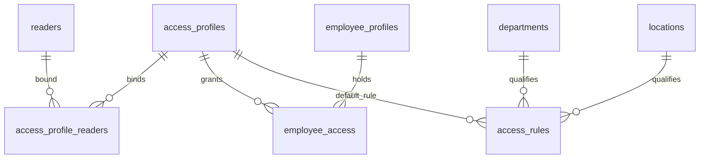
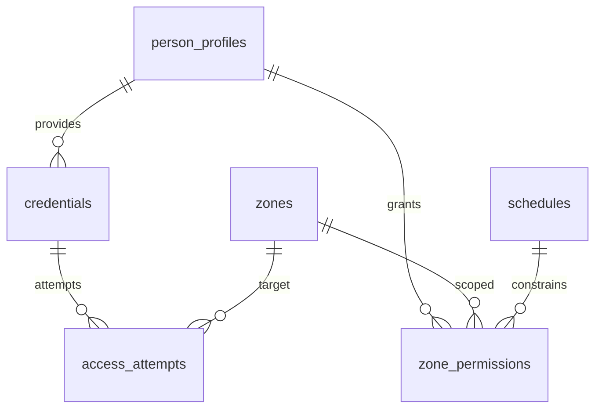
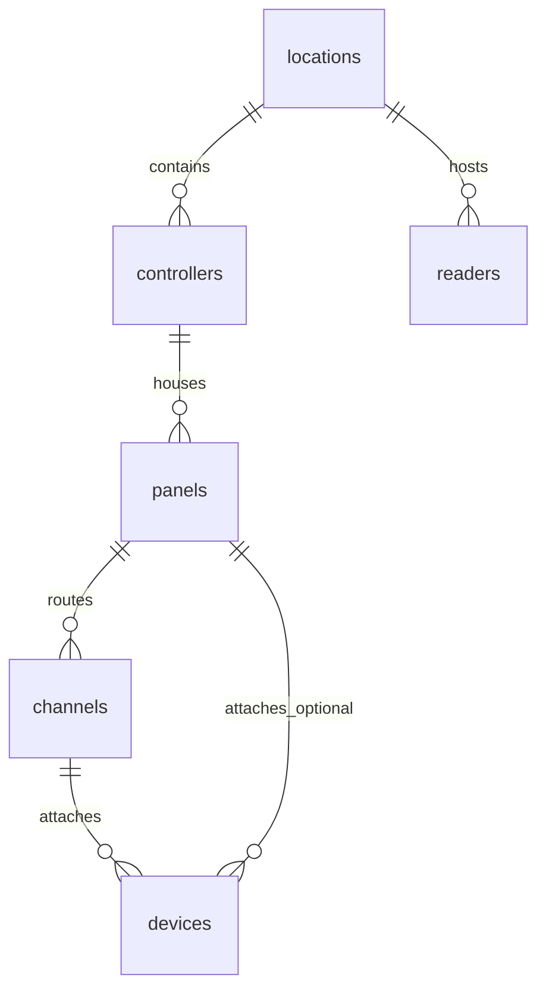

# Database Documentation

> Physical Security & Door Access Control Platform  
> Schema Version: 2025-09-14 (schema_full.sql)  
> Status: Authoritative Reference

---
## 1. Purpose & Scope
This document provides a professional, implementation-level description of the platform database schema. It covers logical domains, entity relationships, constraints, indexing strategy, growth considerations, and evolution guidelines.

---
## 2. Domain Overview
The schema is organized into the following domains:

| Domain | Purpose | Key Tables |
|--------|---------|------------|
| Organizational Structure | Org hierarchy and physical structure | `departments`, `teams`, `locations` |
| Employee Identity | Legacy employee-centric modeling | `employee_profiles`, `employee_photos`, `badge_history`, `access_history`, `employee_access` |
| Generic Identity Layer | Unified abstraction for all person-like entities | `person_profiles`, `credentials`, `zone_permissions` |
| Access Control | Profiles, rules, reader mapping | `access_profiles`, `access_profile_readers`, `access_rules`, `readers` |
| Physical Hardware | Deep physical topology for controllers | `controllers`, `panels`, `channels`, `devices` |
| Zones & Schedules | Logical access segmentation and time rules | `zones`, `schedules`, `zone_permissions` |
| Events & Telemetry | Real-time and historical access attempts | `swipes`, `access_attempts` |
| Visitors & Temporary Access | Guest credentialing | `visitor_badges` |
| Governance & Security | Roles, users, auditing, reason codes | `app_users`, `app_roles`, `user_roles`, `audit_log`, `reason_codes` |
| Policy Templates | Bundle zone/schedule policies | `access_templates` |
| Time / Regionalization | Optional timezone policy assignment | `time_zones` |

---
## 3. High-Level ER Diagram (Global)
```mermaid
erDiagram
    departments ||--o{ teams : contains
    departments ||--o{ employee_profiles : employs
    teams ||--o{ employee_profiles : assigns
    locations ||--o{ employee_profiles : assigns
    locations ||--o{ readers : hosts
    locations ||--o{ controllers : hosts
    controllers ||--o{ panels : manages
    panels ||--o{ channels : provides
    channels ||--o{ devices : connects
    panels ||--o{ devices : optional
    employee_profiles ||--o{ employee_photos : has
    employee_profiles ||--o{ badge_history : tracks
    employee_profiles ||--o{ access_history : captures
    employee_profiles ||--o{ employee_access : assigns
    access_profiles ||--o{ employee_access : referenced
    access_profiles ||--o{ access_profile_readers : maps
    readers ||--o{ access_profile_readers : linked
    employee_profiles ||--o{ swipes : originates
    readers ||--o{ swipes : records
    access_profiles ||--o{ access_rules : used_by
    departments ||--o{ access_rules : scoped
    locations ||--o{ access_rules : scoped
    -- Generic identity layer
    person_profiles ||--o{ credentials : owns
    person_profiles ||--o{ zone_permissions : granted
    zones ||--o{ zone_permissions : controls
    schedules ||--o{ zone_permissions : constrains
    credentials ||--o{ access_attempts : produces
    zones ||--o{ access_attempts : occurs_in
    person_profiles ||--o{ visitor_badges : may_have
    person_profiles ||--o{ visitor_badges : hosts
    access_profiles ||--o{ time_zones : optional
    app_users ||--o{ audit_log : produces
    app_users ||--o{ user_roles : membership
    app_roles ||--o{ user_roles : membership
```

---
## 4. Domain-Focused ER Diagrams
### 4.1 Employee Profile (Legacy) Domain


### 4.2 Access Control Mapping


### 4.3 Generic Identity & Zones


### 4.4 Hardware Topology


---
## 5. Table Reference (Concise)
Below is a structured summary. For full DDL see `schema_full.sql`.

### 5.1 Organizational Tables
- `departments(id, name, description, created_at, updated_at)` — Master org unit
- `teams(id, department_id*, name, description, created_at, updated_at)` — Sub-unit within department
- `locations(id, name, description, address, parent_location_id*, created_at, updated_at)` — Physical or logical site hierarchy

### 5.2 Employee Legacy Domain
- `employee_profiles` — Core HR-like identity (comp_id unique business key)
- `employee_profile_history` — Change audit snapshot (not full SCD but event log)
- `employee_photos` — Binary or URL-based imaging, supports historical & active flag
- `badge_history` — Lifecycle of issued badges
- `access_history` — Timeline of profile changes (grants/updates/revokes)
- `employee_access` — Current effective assignments (with assigned_via provenance)
- `swipes` — Physical reader events by employee (legacy path)

### 5.3 Generic Identity Layer
- `person_profiles` — Polymorphic identity (Employee/Contractor/Visitor)
- `credentials` — Physical/virtual credential artifacts (card/mobile)
- `zone_permissions` — Direct assignment of zone + schedule to a profile
- `visitor_badges` — Temporary visitor tokens linking guest & host
- `access_attempts` — Logical zone-level access decision history

### 5.4 Access & Policy
- `access_profiles` — Bundled permissions; optionally time-zone scoped
- `access_profile_readers` — Reader mapping pivot (many-to-many)
- `access_rules` — Department/location → recommended/automatic profile rule base
- `time_zones` — Named timezone schedule bundles
- `access_templates` — Versioned JSON policy template packs

### 5.5 Hardware Topology
- `controllers` → `panels` → `channels` → `devices` — Progressive layering for physical deployment
- `readers` — Edge access devices referencing `locations` and optionally hardware chain via `channel_id`

### 5.6 Governance & Security
- `app_users`, `app_roles`, `user_roles` — Application-level RBAC
- `audit_log` — Entity-centric JSON event log
- `reason_codes` — Controlled vocabulary (denials, revocations, audit justifications)

---
## 6. Key Relationships & Cardinality
| From | To | Type | Notes |
|------|----|------|-------|
| departments | teams | 1→N | Cascading delete maintains integrity |
| employee_profiles | employee_access | 1→N | Current assignments |
| access_profiles | employee_access | 1→N | Many employees share a profile |
| access_profiles | readers | M→M | Via `access_profile_readers` |
| person_profiles | credentials | 1→N | Supports multiple active/inactive credentials |
| person_profiles | zone_permissions | 1→N | Fine-grained zone-level assignment |
| credentials | access_attempts | 1→N | Historical decision tracking |
| zones | zone_permissions | 1→N | Scoped by schedule |
| schedules | zone_permissions | 1→N | Time gating |
| controllers | panels | 1→N | Physical enclosure model |
| panels | channels | 1→N | IO segmentation |
| channels | devices | 1→N | Edge wiring |
| employee_profiles | swipes | 1→N | Legacy event channel |

---
## 7. Column Conventions
| Convention | Rationale |
|-----------|-----------|
| `id` SERIAL/UUID PK | Uniform primary key naming |
| Foreign keys named `<entity>_id` | Readability & joins |
| `created_at` / `updated_at` | Lifecycle tracking |
| JSONB for flexible fields | Extensibility without migrations |
| ENUMs for controlled state | Enforced domain constraints |
| Partial indexes on booleans | Fast filters (`is_active`, etc.) |

---
## 8. ENUM Types
| Enum | Values | Used In |
|------|--------|---------|
| `credential_type` | Card, Mobile, TempVisitor | `credentials.type` |
| `credential_status` | Active, Revoked, Expired | `credentials.status` |
| `profile_type` | Employee, Contractor, Visitor | `person_profiles.type` |
| `profile_status` | Active, Suspended, Deactivated | `person_profiles.status` |
| `visitor_badge_status` | Active, Expired, Revoked | `visitor_badges.status` |
| `access_outcome` | Allow, Deny | `access_attempts.outcome` |

---
## 9. Indexing Strategy Summary
| Pattern | Example Index | Purpose |
|---------|---------------|---------|
| Foreign key support | `idx_employee_access_employee_id` | Join speed |
| Temporal queries | `idx_swipes_swipe_time` | Time-slice analytics |
| Partial boolean | `idx_employee_profiles_active` | Fast active set lookup |
| Text lookup | `UNIQUE(name)` on vocab tables | Guarantee domain uniqueness |
| High-churn events | `idx_access_attempts_time` | Recent window dashboards |
| Compound contextual | `idx_access_rules_dept_loc` | Rule resolution |

Potential future additions:
- GIN index for JSONB (`metadata`, `template_data`) if queried by key
- BRIN index for large append-only (`swipes`, `access_attempts`) when >10M rows
- Composite `(employee_id, swipe_time DESC)` for recent activity panels

---
## 10. Growth & Partitioning Candidates
| Table | Growth Driver | Strategy |
|-------|---------------|----------|
| `swipes` | Physical reader traffic | Monthly or quarterly partition by `swipe_time` |
| `access_attempts` | Logical auth attempts | BRIN + partition by `timestamp` |
| `audit_log` | System actions | Time partition + retention purge job |
| `badge_history` | Badge churn | Retain 3–5 years; archive older |

---
## 11. Data Retention & Lifecycle
| Category | Retention | Notes |
|----------|-----------|-------|
| Access Attempts | 18–24 months active | Archive to cold storage after TTL |
| Swipes | 24 months | Summarize older to hourly/day aggregates |
| Audit Log | 36 months | Compliance variable by jurisdiction |
| Visitor Badges | 12 months | Expired anonymization after 90 days |
| Photos | Active + 1 prior | Prune inactive large blobs |

---
## 12. Migration & Evolution Guidance
1. Prefer additive migrations (avoid destructive column drops).  
2. Use shadow tables for large refactors (copy → backfill → swap).  
3. Version JSON schema structures in `template_data` & `time_zones.schedule`.  
4. Tag schema releases (git tag `db-vX.Y.Z`).  
5. Maintain backward-compatible API read models during transitions from `employee_profiles` → `person_profiles` if unifying layers.

### Suggested Future Refactors
| Goal | Approach |
|------|----------|
| Unify identity layers | Introduce foreign key from `employee_profiles` to `person_profiles` then gradually dereference direct usage |
| Normalize reason codes | Add category hierarchy table if taxonomy expands |
| Event sourcing | Wrap `access_attempts` & `swipes` behind logical event stream consumer |

---
## 13. Security & Compliance Notes
- PII: `email`, `badge_serial`, photos → classify & encrypt at-rest (pgcrypto/column-level) if mandated.  
- Access Reviews: Reconcile `employee_access` vs `zone_permissions` quarterly.  
- Invalidate credentials by flipping `credential_status` + revoke in hardware queue.  
- Audit Integrity: Apply hashing chain (future enhancement) over `audit_log` rows.

---
## 14. Example Analytical Queries
```sql
-- 1. Active employees without recent swipes (last 14 days)
SELECT e.id, e.comp_id, e.first_name, e.last_name
FROM employee_profiles e
LEFT JOIN LATERAL (
    SELECT 1 FROM swipes s
    WHERE s.employee_id = e.id AND s.swipe_time >= NOW() - INTERVAL '14 days'
    LIMIT 1
) recent ON TRUE
WHERE e.is_active = TRUE AND recent IS NULL;

-- 2. Top 10 readers by denies in past 24h
SELECT r.name, COUNT(*) AS denies
FROM swipes s
JOIN readers r ON r.id = s.reader_id
WHERE s.swipe_time >= NOW() - INTERVAL '24 hours' AND s.access_granted = FALSE
GROUP BY r.name
ORDER BY denies DESC
LIMIT 10;

-- 3. Credential health summary
SELECT type, status, COUNT(*)
FROM credentials
GROUP BY type, status;
```

---
## 15. Change Log (Schema-Level)
| Version | Date | Summary |
|---------|------|---------|
| 1.0 | 2025-09-14 | Initial consolidated canonical schema authored (schema_full.sql) |

---
## 16. Appendix
### 16.1 View: `vw_active_employees`
Purpose: Lightweight list for quick UI population.

### 16.2 View: `vw_employee_access_profiles`
Purpose: Resolves employee → active access profile membership in a denormalized grid-friendly format.

---
## 17. ER Diagram Export
If a PNG/SVG is required, render Mermaid sources under `docs/er/`.

### 17.1 Available Diagram Sources
| Purpose | File |
|---------|------|
| Global Schema | docs/er/global-er.mmd |
| Employee Domain | docs/er/employee-domain.mmd |
| Access Mapping | docs/er/access-mapping.mmd |
| Identity & Zones | docs/er/identity-zones.mmd |
| Hardware Topology | docs/er/hardware-topology.mmd |

### 17.2 One-shot PowerShell Export
```powershell
# From repository root
pwsh -File .\docs\er\export-er-diagrams.ps1 -OutDir .\docs\er\rendered
```
This generates both SVG and PNG variants.

### 17.3 Manual Single Diagram (npx)
```powershell
npx -y @mermaid-js/mermaid-cli -i .\docs\er\global-er.mmd -o .\docs\er\global-er.svg
```

### 17.4 Add to npm Scripts (Optional)
Add to `package.json` (root or frontend) scripts section:
```json
"scripts": {
  "er:export": "pwsh ./docs/er/export-er-diagrams.ps1"
}
```
Then run:
```powershell
npm run er:export
```

### 17.5 CI Integration Hint
- Cache `~/.npm` for faster mermaid-cli installs
- Publish artifacts from `docs/er/rendered` as build artifacts or push to docs site.

---
**End of Database Documentation**
