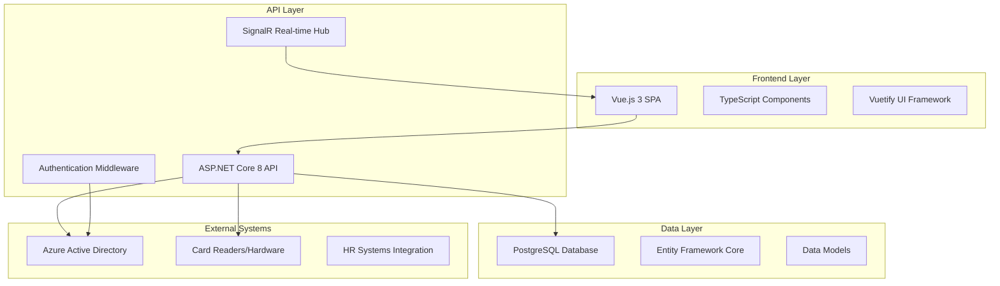

# Physical Security & Access Control Platform

> **Professional Documentation v1.0**  
> **Last Updated**: September 14, 2025  
> **Project Status**: Development Phase - Core Features Implemented  

---

## 📋 Table of Contents

1. [Executive Summary](#executive-summary)
2. [Project Overview](#project-overview)
3. [System Architecture](#system-architecture)
4. [Technology Stack](#technology-stack)
5. [Database Schema](#database-schema)
6. [API Documentation](#api-documentation)
7. [Frontend Application](#frontend-application)
8. [Development Environment](#development-environment)
9. [Features & Capabilities](#features--capabilities)
10. [Security & Authentication](#security--authentication)
11. [Deployment Guide](#deployment-guide)
12. [Maintenance & Operations](#maintenance--operations)
13. [Future Roadmap](#future-roadmap)

---

## Executive Summary

The **Physical Security & Access Control Platform** is a comprehensive enterprise-grade solution designed to manage company physical security, door access control, employee profiles, and access management. The system provides a modern web-based interface for security administrators to control access permissions, manage employee profiles, issue and revoke access cards, and monitor security events across the organization.

### Key Business Value
- **Centralized Security Management**: Single platform for all physical access control operations
- **Real-time Monitoring**: Live dashboard with access events and system status
- **Scalable Architecture**: Modern microservices design supporting enterprise growth
- **Compliance Ready**: Audit trails and reporting capabilities for security compliance
- **User-Friendly Interface**: Intuitive Windows-style UI for security personnel

---

## Project Overview

### Project Scope
This platform addresses the complete lifecycle of physical security management:

- **Employee Profile Management**: Create, update, and maintain employee records
- **Access Control**: Define and manage access permissions across security zones
- **Card Management**: Issue, track, and revoke physical access cards
- **Infrastructure Management**: Monitor and configure security readers and devices
- **Reporting & Analytics**: Generate security reports and audit trails
- **Visitor Management**: Handle temporary access for guests and contractors

### Business Requirements
- Replace legacy access control systems with modern web-based solution
- Integrate with HR systems for automated employee onboarding/offboarding
- Provide real-time security monitoring and alerting
- Support multiple access card technologies and reader types
- Ensure compliance with corporate security policies and regulations

---

## System Architecture

### High-Level Architecture



### Application Layers

#### 1. **Presentation Layer (Frontend)**
- **Framework**: Vue.js 3 with Composition API
- **UI Library**: Vuetify 3 (Material Design components)
- **Type Safety**: TypeScript for enhanced development experience
- **State Management**: Reactive data binding with Vue's reactivity system
- **Routing**: Vue Router 4 for single-page application navigation

#### 2. **API Layer (Backend)**
- **Framework**: ASP.NET Core 8 with minimal APIs
- **Architecture**: RESTful API design with resource-based endpoints
- **Documentation**: Swagger/OpenAPI for API documentation
- **Real-time**: SignalR for live updates and notifications
- **Logging**: Serilog for structured logging and monitoring

#### 3. **Data Access Layer**
- **ORM**: Entity Framework Core 8 for database operations
- **Database**: PostgreSQL for enterprise-grade data storage
- **Migrations**: Code-first approach with automatic schema management
- **Connection**: Connection pooling and optimized query performance

#### 4. **Security Layer**
- **Authentication**: Microsoft Identity platform integration
- **Authorization**: Role-based access control (RBAC)
- **API Security**: JWT tokens and middleware-based protection
- **Data Protection**: Encrypted sensitive data and secure transmission

---

## Technology Stack

### Backend Technologies

| Component | Technology | Version | Purpose |
|-----------|------------|---------|----------|
| **Runtime** | .NET | 8.0 | Application framework |
| **Web Framework** | ASP.NET Core | 8.0 | Web API and services |
| **Database** | PostgreSQL | 15+ | Primary data storage |
| **ORM** | Entity Framework Core | 8.0 | Data access layer |
| **Authentication** | Microsoft Identity Web | 3.1.0 | Azure AD integration |
| **Logging** | Serilog | 8.0 | Structured logging |
| **Documentation** | Swagger/OpenAPI | 9.0 | API documentation |
| **Real-time** | SignalR | Built-in | Live updates |

### Frontend Technologies

| Component | Technology | Version | Purpose |
|-----------|------------|---------|----------|
| **Framework** | Vue.js | 3.4.0 | Progressive web framework |
| **Language** | TypeScript | 5.4.0 | Type-safe development |
| **UI Framework** | Vuetify | 3.5.0 | Material Design components |
| **Build Tool** | Vite | 5.0.0 | Fast build and development |
| **HTTP Client** | Axios | 1.7.0 | API communication |
| **Routing** | Vue Router | 4.3.0 | Client-side navigation |
| **Authentication** | MSAL Browser | 3.16.0 | Azure AD client integration |

### Development Tools

| Tool | Purpose |
|------|---------|
| **ESLint** | Code quality and linting |
| **Prettier** | Code formatting |
| **TypeScript** | Static type checking |
| **Swagger UI** | API testing and documentation |
| **Git** | Version control |
| **Visual Studio Code** | Development environment |

---

## Database Schema

### Core Entities

#### **Employee Profiles**
```sql
employee_profiles (
    id SERIAL PRIMARY KEY,
    comp_id VARCHAR(8) UNIQUE NOT NULL,
    first_name VARCHAR(100) NOT NULL,
    last_name VARCHAR(100) NOT NULL,
    email VARCHAR(255) UNIQUE NOT NULL,
    hire_date DATE NOT NULL,
    expire_date DATE,
    department_id INT REFERENCES departments(id),
    team_id INT REFERENCES teams(id),
    location_id INT REFERENCES locations(id),
    badge_serial VARCHAR(50),
    is_active BOOLEAN DEFAULT TRUE,
    created_at TIMESTAMPTZ DEFAULT NOW(),
    updated_at TIMESTAMPTZ DEFAULT NOW()
)
```

#### **Access Management**
```sql
access_profiles (
    id SERIAL PRIMARY KEY,
    name VARCHAR(100) NOT NULL,
    description TEXT,
    is_active BOOLEAN DEFAULT TRUE
)

employee_access (
    id SERIAL PRIMARY KEY,
    employee_id INT REFERENCES employee_profiles(id),
    access_profile_id INT REFERENCES access_profiles(id),
    granted_at TIMESTAMPTZ DEFAULT NOW(),
    expires_at TIMESTAMPTZ,
    active BOOLEAN DEFAULT TRUE
)
```

#### **Infrastructure Management**
```sql
readers (
    id SERIAL PRIMARY KEY,
    name VARCHAR(100) NOT NULL,
    device_type VARCHAR(50) NOT NULL,
    capabilities TEXT[],
    location VARCHAR(255)
)

access_profile_readers (
    id SERIAL PRIMARY KEY,
    access_profile_id INT REFERENCES access_profiles(id),
    reader_id INT REFERENCES readers(id)
)
```

### Key Relationships

- **Employee → Department**: Many-to-One relationship for organizational structure
- **Employee → Access Profiles**: Many-to-Many through employee_access junction table
- **Access Profiles → Readers**: Many-to-Many through access_profile_readers junction table
- **Employee → Teams**: Optional Many-to-One for team-based access control
- **Employee → Locations**: Many-to-One for location-based security policies

---

## API Documentation

### Base Configuration
- **Base URL**: `http://localhost:5000/api`
- **Content-Type**: `application/json`
- **Authentication**: Bearer token (JWT)
- **API Version**: v1

### Employee Management Endpoints

#### **GET /api/employees**
Retrieve paginated list of employees with filtering and search capabilities.

**Parameters:**
- `page` (optional): Page number (default: 1)
- `pageSize` (optional): Items per page (default: 20)
- `search` (optional): Search term for name/email
- `departmentId` (optional): Filter by department
- `isActive` (optional): Filter by active status

**Response:**
```json
{
    "employees": [
        {
            "id": 1,
            "compId": "JS123456",
            "firstName": "John",
            "lastName": "Smith",
            "email": "john.smith@company.com",
            "hireDate": "2024-01-15",
            "expireDate": null,
            "isActive": true,
            "department": "Engineering",
            "team": "Backend Development",
            "location": "New York Office",
            "badgeSerial": "BADGE001",
            "accessProfiles": ["Standard Access", "Engineering Lab"],
            "photoUrl": null
        }
    ],
    "totalCount": 150,
    "currentPage": 1,
    "totalPages": 8
}
```

#### **POST /api/employees**
Create a new employee profile.

**Request Body:**
```json
{
    "firstName": "Jane",
    "lastName": "Doe",
    "email": "jane.doe@company.com",
    "departmentId": 1,
    "teamId": 5,
    "locationId": 2,
    "hireDate": "2025-01-01",
    "expireDate": null,
    "badgeSerial": "BADGE002",
    "isActive": true
}
```

**Response:** `201 Created` with employee object

#### **GET /api/employees/{id}**
Retrieve detailed employee information including access history and audit logs.

#### **PUT /api/employees/{id}**
Update existing employee profile information.

#### **DELETE /api/employees/{id}**
Deactivate employee profile (soft delete).

### Card Fields Management Endpoints

#### **GET /api/employees/readers**
Retrieve all configured access card readers.

**Response:**
```json
[
    {
        "id": 1,
        "name": "Main Entrance",
        "deviceType": "HID ProxCard",
        "capabilities": ["read", "write", "biometric"],
        "location": "Building A - Lobby"
    }
]
```

#### **GET /api/employees/access-profiles**
Retrieve all access profiles with associated permissions.

#### **GET /api/employees/card-fields-summary**
Get comprehensive summary of card fields infrastructure including reader counts, profile metrics, and system status.

---

## Frontend Application

### Component Architecture

#### **Core Components**

1. **Dashboard.vue** - Main application shell
   - Navigation tabs (Employee Profiles, Card Fields)
   - Employee list and search functionality
   - Modal management for forms
   - Real-time data updates

2. **Employee Management**
   - Employee profile cards with Windows-style design
   - Search and filtering capabilities
   - Detailed employee information display
   - Access profile management

3. **Card Fields Management**
   - Infrastructure overview with reader status
   - Access profile configuration
   - Reader-to-profile relationship mapping
   - System health monitoring

4. **New Employee Modal**
   - Comprehensive form with validation
   - Organized sections (Personal, Employment, Badge)
   - Real-time field validation
   - Success/error handling

### UI/UX Design

#### **Design System**
- **Theme**: Windows-style interface with dark/light mode support
- **Color Palette**: Professional blue/gray scheme with accent colors
- **Typography**: Inter font family for modern, readable text
- **Icons**: Material Design Icons for consistency
- **Layout**: Responsive grid system with mobile support

#### **User Experience Features**
- **Intuitive Navigation**: Tab-based interface for different functional areas
- **Quick Actions**: Prominent action buttons for common tasks
- **Visual Feedback**: Loading states, success/error messages, and progress indicators
- **Accessibility**: Keyboard navigation and screen reader support
- **Performance**: Optimized rendering with lazy loading and virtual scrolling

### State Management

#### **Data Flow**
```typescript
// Reactive data structure
const state = reactive({
    employees: [] as Employee[],
    cardFields: {} as CardFieldsSummary,
    loading: false,
    error: null
});

// API integration
const employeeService = {
    async fetchEmployees(): Promise<Employee[]> {
        return await api.get('/employees');
    },
    async createEmployee(data: CreateEmployeeRequest): Promise<Employee> {
        return await api.post('/employees', data);
    }
};
```

---

## Development Environment

### Prerequisites

#### **Backend Requirements**
- **.NET 8 SDK**: Download from Microsoft .NET website
- **PostgreSQL 15+**: Database server installation
- **Visual Studio 2022** or **VS Code**: IDE with C# extensions
- **Git**: Version control system

#### **Frontend Requirements**
- **Node.js 18+**: JavaScript runtime environment
- **npm**: Package manager (included with Node.js)
- **Modern Browser**: Chrome, Firefox, or Edge for development

### Setup Instructions

#### **1. Clone Repository**
```bash
git clone <repository-url>
cd test1
```

#### **2. Backend Setup**
```bash
# Navigate to backend directory
cd backend/src

# Restore NuGet packages
dotnet restore

# Update database connection string in appsettings.json
# Configure PostgreSQL connection

# Run database migrations
dotnet ef database update

# Start the API server
dotnet run
```

#### **3. Frontend Setup**
```bash
# Navigate to frontend directory
cd frontend

# Install npm dependencies
npm install

# Start development server
npm run dev
```

#### **4. Environment Configuration**

**Backend (appsettings.Development.json):**
```json
{
    "ConnectionStrings": {
        "DefaultConnection": "Host=localhost;Database=access_control;Username=postgres;Password=your_password"
    },
    "Logging": {
        "LogLevel": {
            "Default": "Information",
            "Microsoft": "Warning"
        }
    },
    "AllowedHosts": "*"
}
```

**Frontend (Environment Variables):**
```javascript
// vite.config.ts
export default defineConfig({
    server: {
        proxy: {
            '/api': 'http://localhost:5000'
        }
    }
});
```

### Development Workflow

#### **Code Standards**
- **Backend**: Follow Microsoft C# coding conventions
- **Frontend**: ESLint and Prettier configuration for consistent formatting
- **Git**: Conventional commit messages and feature branch workflow
- **Testing**: Unit tests for business logic and integration tests for APIs

#### **Build Process**
```bash
# Backend build
dotnet build --configuration Release

# Frontend build
npm run build

# Run tests
dotnet test
npm run test
```

---

## Features & Capabilities

### ✅ Implemented Features

#### **Employee Profile Management**
- **Complete CRUD Operations**: Create, read, update, and delete employee profiles
- **Advanced Search**: Filter by name, email, department, or active status
- **Bulk Operations**: Import/export employee data
- **Photo Management**: Upload and manage employee photos
- **Audit Trail**: Track all profile changes with timestamps and user information

#### **Access Control System**
- **Profile-Based Access**: Define access profiles for different roles and responsibilities
- **Zone Management**: Configure security zones with specific access requirements
- **Reader Integration**: Support for various card reader technologies and protocols
- **Real-time Monitoring**: Live dashboard showing access events and system status

#### **Card Fields Infrastructure**
- **Reader Management**: Configure and monitor physical card readers
- **Access Profile Configuration**: Define and manage access permission groups
- **Relationship Mapping**: Visual representation of reader-to-profile associations
- **System Health Monitoring**: Real-time status of all connected devices

#### **User Interface Features**
- **Responsive Design**: Optimized for desktop, tablet, and mobile devices
- **Dark/Light Themes**: User preference-based theme switching
- **Windows-Style UI**: Professional enterprise interface design
- **Modal Forms**: Streamlined data entry with validation and error handling

### 🚧 In Development

#### **Advanced Reporting**
- **Security Reports**: Access logs, failed attempts, and usage analytics
- **Compliance Reports**: Audit trails for regulatory compliance
- **Custom Dashboards**: Configurable widgets and KPIs
- **Scheduled Reports**: Automated report generation and distribution

#### **Integration Capabilities**
- **HR System Integration**: Automated employee onboarding/offboarding
- **Single Sign-On (SSO)**: Enterprise authentication integration
- **Mobile Application**: Native mobile app for field operations
- **API Extensions**: Webhook support for third-party integrations

### 📋 Planned Features

#### **Visitor Management**
- **Guest Registration**: Temporary access for visitors and contractors
- **Escort Requirements**: Mandatory escort policies for sensitive areas
- **Time-Limited Access**: Automatic expiration of visitor permissions
- **Pre-registration**: Advance visitor scheduling and approval workflow

#### **Advanced Security**
- **Biometric Integration**: Fingerprint and facial recognition support
- **Multi-Factor Authentication**: Enhanced security for sensitive areas
- **Emergency Procedures**: Lockdown protocols and emergency access
- **Fraud Detection**: Anomaly detection for suspicious access patterns

---

## Security & Authentication

### Authentication Strategy

#### **Azure Active Directory Integration**
- **Enterprise SSO**: Seamless integration with organizational identity provider
- **Role-Based Access**: Granular permissions based on job functions
- **Multi-Factor Authentication**: Enhanced security for administrative functions
- **Token Management**: Secure JWT token handling with automatic refresh

#### **API Security**
```csharp
[Authorize(Roles = "SecurityAdmin,SystemAdmin")]
[HttpPost("employees")]
public async Task<ActionResult> CreateEmployee([FromBody] CreateEmployeeRequest request)
{
    // Secured endpoint implementation
}
```

### Data Protection

#### **Encryption Standards**
- **Data at Rest**: AES-256 encryption for sensitive database fields
- **Data in Transit**: TLS 1.3 for all client-server communications
- **Key Management**: Azure Key Vault integration for encryption key storage
- **PII Protection**: Special handling for personally identifiable information

#### **Audit & Compliance**
- **Access Logging**: Comprehensive audit trails for all system operations
- **Data Retention**: Configurable retention policies for compliance requirements
- **Privacy Controls**: GDPR-compliant data handling and deletion capabilities
- **Security Monitoring**: Real-time alerts for suspicious activities

---

## Deployment Guide

### Production Environment

#### **Infrastructure Requirements**

**Minimum System Requirements:**
- **CPU**: 4 cores (2.4 GHz or higher)
- **RAM**: 8 GB minimum, 16 GB recommended
- **Storage**: 100 GB SSD for application and database
- **Network**: 1 Gbps Ethernet connection
- **OS**: Windows Server 2019+ or Linux (Ubuntu 20.04+)

**Recommended Production Setup:**
- **Web Server**: IIS or Nginx reverse proxy
- **Application Server**: ASP.NET Core Kestrel
- **Database**: PostgreSQL cluster with replication
- **Load Balancer**: Azure Load Balancer or HAProxy
- **Monitoring**: Application Insights or ELK stack

#### **Deployment Steps**

**1. Database Setup**
```sql
-- Create production database
CREATE DATABASE access_control_prod;

-- Run migrations
dotnet ef database update --environment Production
```

**2. Application Deployment**
```bash
# Build production release
dotnet publish -c Release -o ./publish

# Deploy to server
scp -r ./publish/ user@server:/opt/access-control/

# Configure systemd service (Linux)
sudo systemctl enable access-control
sudo systemctl start access-control
```

**3. Frontend Deployment**
```bash
# Build for production
npm run build

# Deploy to web server
rsync -avz ./dist/ user@server:/var/www/access-control/
```

### Docker Deployment

#### **Containerization**
```dockerfile
# Backend Dockerfile
FROM mcr.microsoft.com/dotnet/aspnet:8.0 AS runtime
WORKDIR /app
COPY publish/ .
EXPOSE 80
ENTRYPOINT ["dotnet", "AccessControl.Api.dll"]
```

```dockerfile
# Frontend Dockerfile
FROM nginx:alpine
COPY dist/ /usr/share/nginx/html/
COPY nginx.conf /etc/nginx/nginx.conf
EXPOSE 80
```

#### **Docker Compose**
```yaml
version: '3.8'
services:
  api:
    build: ./backend
    ports:
      - "5000:80"
    environment:
      - ConnectionStrings__DefaultConnection=Host=db;Database=access_control;Username=postgres;Password=password
    depends_on:
      - db
  
  frontend:
    build: ./frontend
    ports:
      - "80:80"
    depends_on:
      - api
  
  db:
    image: postgres:15
    environment:
      POSTGRES_DB: access_control
      POSTGRES_USER: postgres
      POSTGRES_PASSWORD: password
    volumes:
      - postgres_data:/var/lib/postgresql/data
```

---

## Maintenance & Operations

### Monitoring & Logging

#### **Application Monitoring**
- **Health Checks**: Automated endpoint monitoring for system availability
- **Performance Metrics**: Response times, throughput, and error rates
- **Resource Utilization**: CPU, memory, and disk usage monitoring
- **Database Performance**: Query performance and connection pool metrics

#### **Logging Strategy**
```csharp
// Structured logging configuration
Log.Logger = new LoggerConfiguration()
    .MinimumLevel.Information()
    .Enrich.FromLogContext()
    .WriteTo.Console()
    .WriteTo.File("logs/app-.txt", rollingInterval: RollingInterval.Day)
    .CreateLogger();
```

### Backup & Recovery

#### **Database Backup**
```bash
# Daily automated backup
pg_dump -h localhost -U postgres access_control > backup_$(date +%Y%m%d).sql

# Point-in-time recovery setup
archive_mode = on
archive_command = 'cp %p /backup/archive/%f'
```

#### **Disaster Recovery Plan**
1. **Recovery Time Objective (RTO)**: 4 hours maximum downtime
2. **Recovery Point Objective (RPO)**: Maximum 1 hour data loss
3. **Backup Retention**: 30 days local, 1 year cloud storage
4. **Testing Schedule**: Monthly disaster recovery drills

### Performance Optimization

#### **Database Optimization**
- **Indexing Strategy**: Optimized indexes for frequent queries
- **Connection Pooling**: Efficient database connection management
- **Query Optimization**: Regularly review and optimize slow queries
- **Partitioning**: Table partitioning for large datasets

#### **Application Performance**
- **Caching**: Redis integration for frequently accessed data
- **CDN**: Content delivery network for static assets
- **Compression**: Response compression for reduced bandwidth
- **Lazy Loading**: Efficient data loading strategies

---

## Future Roadmap

### Short-term Goals (3-6 months)

#### **Enhanced User Experience**
- **Advanced Filtering**: More sophisticated search and filter options
- **Bulk Operations**: Mass update capabilities for employee profiles
- **Dashboard Customization**: User-configurable dashboard layouts
- **Mobile Responsiveness**: Improved mobile experience and touch interfaces

#### **Integration Improvements**
- **HR System Connectors**: Pre-built integrations with popular HR systems
- **Single Sign-On**: Enhanced SSO capabilities with multiple providers
- **API Webhooks**: Real-time notifications for external systems
- **Import/Export Tools**: Enhanced data migration and backup capabilities

### Medium-term Goals (6-12 months)

#### **Advanced Security Features**
- **Biometric Integration**: Support for fingerprint and facial recognition
- **Anomaly Detection**: AI-powered suspicious activity detection
- **Emergency Protocols**: Automated lockdown and emergency procedures
- **Advanced Audit**: Enhanced compliance reporting and audit trails

#### **Scalability & Performance**
- **Microservices Architecture**: Decomposition into smaller, scalable services
- **Cloud-Native Deployment**: Kubernetes orchestration and auto-scaling
- **Advanced Caching**: Distributed caching for improved performance
- **Real-time Analytics**: Live reporting and dashboard updates

### Long-term Vision (12+ months)

#### **Artificial Intelligence Integration**
- **Predictive Analytics**: AI-powered access pattern analysis
- **Smart Recommendations**: Intelligent access profile suggestions
- **Automated Compliance**: AI-assisted compliance monitoring and reporting
- **Behavioral Analysis**: Machine learning for security threat detection

#### **Platform Expansion**
- **Mobile Applications**: Native iOS and Android applications
- **IoT Integration**: Support for smart building and IoT devices
- **Multi-tenant Architecture**: SaaS offering for multiple organizations
- **Global Deployment**: Multi-region support with data residency compliance

---

## Project Metrics & KPIs

### Development Metrics
- **Code Coverage**: 85%+ unit test coverage target
- **API Response Times**: <200ms average for standard operations
- **Database Query Performance**: <100ms for 95% of queries
- **Build Time**: <5 minutes for full application build
- **Deployment Time**: <10 minutes for production deployment

### Business Metrics
- **User Adoption**: Track monthly active users and feature usage
- **System Uptime**: 99.9% availability target
- **Performance Improvement**: 50% reduction in manual access management tasks
- **Security Incidents**: Zero successful unauthorized access attempts
- **Compliance Score**: 100% passing rate for security audits

---

## Support & Documentation

### Technical Support
- **Documentation**: Comprehensive API documentation and user guides
- **Issue Tracking**: GitHub Issues for bug reports and feature requests
- **Knowledge Base**: Searchable documentation and troubleshooting guides
- **Community Forums**: Developer community for questions and discussions

### Training Resources
- **Administrator Guide**: Complete guide for system administrators
- **User Manual**: End-user documentation with screenshots and workflows
- **Video Tutorials**: Step-by-step video guides for common tasks
- **API Reference**: Complete API documentation with examples

### Contact Information
- **Development Team**: development@company.com
- **Technical Support**: support@company.com
- **Security Issues**: security@company.com
- **General Inquiries**: info@company.com

---

**Document Version**: 1.0  
**Last Updated**: September 14, 2025  
**Next Review**: October 14, 2025  

*This document is maintained by the development team and updated regularly to reflect the current state of the project.*